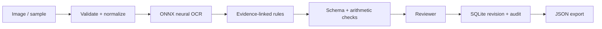

# Document AI Workbench

**Turn an invoice image into reviewable, source-linked structured data using real local neural OCR.**

An applied AI engineering portfolio project by Nemanja Stancic. Built for a five-minute walkthrough: run an invoice, inspect the evidence, catch an inconsistency, correct it, and export an auditable result.

**Python · FastAPI · ONNX Runtime · RapidOCR · SQLite · Vanilla JavaScript**

[Run the demo](#run-locally) · [Five-minute walkthrough](#try-this-walkthrough) · [Architecture](#what-is-actually-ai) · [Evaluation](#tests-and-evaluation)

## Reviewer snapshot

| Engineering question | What this project demonstrates |
|---|---|
| Where did an extracted value come from? | Each field links to an OCR line and its image bounding box. |
| How are wrong outputs handled? | Missing fields remain empty; exact decimal checks catch inconsistent totals. |
| Can a reviewer correct the result safely? | SQLite transactions, revision checks, before/after changes and approval notes. |
| What has been measured? | Six unit/API tests pass. Real OCR: 7/7 fields on clean and inconsistent invoices, 5/7 on the degraded scan. |

The three-image evaluation is a small synthetic regression fixture, not an accuracy claim for arbitrary invoices. The missing invoice number and lost supplier spaces in the degraded scan are retained in the reported results.

## Run locally

Install **Python 3.12** and run from this directory:

```sh
python run.py
```

On macOS/Linux, use `python3 run.py`. The launcher creates `.venv`, installs pinned direct dependencies on its first run, then opens the service at **http://127.0.0.1:4181**. Initial package installation needs internet; the bundled OCR models subsequently run locally on CPU. No API key or paid service. Stop with Ctrl+C.

Manual setup:

```powershell
python -m venv .venv
.venv/Scripts/python -m pip install -r requirements.txt
.venv/Scripts/python -m uvicorn app:app --host 127.0.0.1 --port 4181
```

For Unix, use `.venv/bin/python`. API documentation: `/docs`.

## Try this walkthrough

1. Select **Clean invoice**, then **Run extraction**. This invokes the OCR model; it does not return prewritten OCR output.
2. Click an **OCR score** beside a field to highlight its source bounding box. Focus an input for the same interaction.
3. Select **Arithmetic mismatch**. The image really says `Subtotal: 200.00`, `Tax: 14.00`, `Total: 219.00`. The engine should transcribe it faithfully; the arithmetic validator rejects approval.
4. For this fictional exercise, set total to `214.00`, add a note such as “Corrected the synthetic total to match its components,” and approve. A real invoice discrepancy would need supplier verification, not an assumed correction.
5. Export JSON and compare original extraction, reviewed values, source regions, and before/after audit entries. Reload the page and reopen the document from local history.
6. Upload a PNG/JPEG/WebP invoice or use **Soft scan**. See the scope limits below before interpreting results.

## What is actually AI?

| Stage | Implementation | Inspectable output |
|---|---|---|
| Read image | RapidOCR 1.4.4 + bundled PP-OCR ONNX models | Text, quadrilateral bounding boxes, recognition scores |
| Extract fields | Deterministic, anchored label rules | Source line ID for each supported field; missing fields stay empty |
| Validate | Date/currency schema + exact `Decimal` arithmetic | Missing, malformed and inconsistent values |
| Review | Human corrections, optimistic revision checks | Before/after changes and approval note |
| Persist | SQLite transaction | Local review state and append-only audit entries in the API |

There is **no LLM** in this project. The distinction is deliberate: neural OCR produces evidence; constrained rules make the extraction behavior inspectable. OCR scores are **not calibrated field-correctness probabilities**. Human review is required even when checks pass.



## Tests and evaluation

```powershell
.venv/Scripts/python -m pytest -q
.venv/Scripts/python evaluate.py
```

Six unit/API tests cover missing evidence, amount validation, image limits, rejected approval, audit diffs, stale writes and origin protection. `evaluate.py` runs **real OCR** against three fictional images and reports exact matches for all seven fields, including the intentionally wrong source total. The clean and mismatch fixtures must extract 7/7 fields, and the arithmetic mismatch must be caught. The soft scan is an intentional degradation case with a lower regression floor and missing-field review checks. On the tested Windows environment: clean **7/7**, mismatch **7/7**, soft scan **5/7** (supplier spaces lost; invoice number missing). This tiny same-template fixture is **not a representative OCR benchmark**.

Synthetic source images are committed for reproducible use. `make_samples.py` regenerates them with an available system font; the font may change pixels across operating systems. Evaluation runs use the committed images.

`ci/checks.yml` is a ready-to-enable GitHub Actions template. Automatic CI is not enabled because the upload credential lacks workflow permission. With an appropriately authorized GitHub login, place it in `.github/workflows/checks.yml` to enable it. Local tests and the real OCR evaluation were run on Windows/Python 3.12.

## Engineering decisions and limitations

- **Narrow extraction contract:** English, inline labels such as `Supplier:` and `Total:`. Arbitrary layouts, split labels, multilingual invoices, line-item tables, handwriting and PDFs need additional work. Unsupported fields stay blank for review.
- **Local data:** uploads, SQLite records and images stay under ignored `runtime/`. No cloud inference or telemetry export. Never put real customer documents in the Git repository.
- **Bounds:** eight-megabyte files, twelve-megapixel images, strict supported formats; filenames are UUIDs rather than user-supplied paths. A single inference lock bounds concurrent model execution, but this is not an internet-facing rate limiter.
- **Review semantics:** original OCR extraction remains immutable in each document; a save creates another revision. Approval requires a note and valid fields. A later edit puts the record back into review. The database is locally writable, so this is not a tamper-proof or authenticated compliance audit.
- **Deployment scope:** one local user, loopback binding, Host/Origin checks. No authentication, tenancy, durable queue, antivirus scan, encryption-at-rest policy or retention service. Production work would need those plus representative evaluation and calibrated abstention thresholds.
- **Reproducibility:** direct dependency versions are pinned; `requirements-lock.txt` captures the tested Windows/Python 3.12 environment including transitive versions. Platform wheels can differ.

## Learning roadmap

1. Read `pipeline.py` and add a new labeled field with an evidence link.
2. Replace rules with a layout-aware extractor while preserving the output contract and raw evidence.
3. Build a varied, labeled invoice corpus. Measure field accuracy, abstention and reviewer correction rate per layout.
4. Add a queue and resumable jobs, then test duplicate processing and failed OCR recovery.
5. Add authentication and document-level access control before considering shared hosting.

## Why this is relevant to 2026 hiring

Qualitative examples checked September 17, 2026, not a claim about market-wide rankings or scarcity:

- [Saaf AI — Forward-Deployed AI Engineer](https://jobs.ashbyhq.com/AHL-SaafAI/cf683b2f-f1db-4ca0-9bac-57eb64827c0a/): document workflows, OCR/extraction, structured outputs and human review.
- [SpotDraft — Junior Applied AI Engineer](https://jobs.ashbyhq.com/spotdraft/a2ec9cbd-dffc-4c64-b235-09f86859fb57): document parsing/OCR, evaluation and shipping applied AI systems.
- [Qumis — Founding Staff AI Engineer](https://jobs.ashbyhq.com/qumis/bcc451fd-d204-4b1c-b779-9d346ee71843/): document intelligence, evidence and production workflows.

Roles differ in seniority; this project demonstrates a slice of their engineering requirements, not all role qualifications. Listings may close.

## References

- [RapidOCR project and model ecosystem](https://github.com/RapidAI/RapidOCR)
- [FastAPI documentation](https://fastapi.tiangolo.com/)
- `rapidocr-onnxruntime` and bundled model components retain their upstream licenses. No model binaries are copied into this repo.

## Related portfolio projects

- [PatchProof](https://github.com/cws1121/patchproof): coding-agent evaluation, patch verification and approval.
- [ML Drift Control Room](https://github.com/cws1121/ml-drift-control-room): model monitoring, retraining and gated local promotion.
